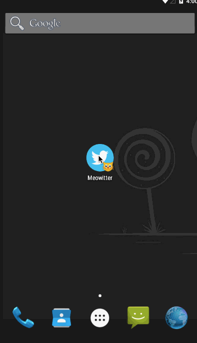

# Twitter Client - Week 3 and Week 4 CodePath Android Assignment

This is an Android demo of a Twitter Client.

Time spent: lots of hours spent in total

Week 4
Completed user stories:

* [x] Required:	Includes all required user stories from Week 3 Twitter Client
* [x] Required:	User can switch between Timeline and Mention views using tabs.
* [x] Required: User can view their home timeline tweets.
* [x] Required:	User can view the recent mentions of their username.
* [x] Required: User can navigate to view their own profile
* [x] Required: User can see picture, tagline, # of followers, # of following, and tweets on their profile.
* [x] Required: User can click on the profile image in any tweet to see another user's profile.
* [x] Required: User can see picture, tagline, # of followers, # of following, and tweets of clicked user.
* [x] Required: Profile view should include that user's timeline
* [x] Required: User can infinitely paginate any of these timelines (home, mentions, user) by scrolling to the bottom
* [x] Advanced: Robust error handling, check if internet is available, handle error cases, network failures
* [x] Advanced (done in Week 3): User can "reply" to any tweet on their home timeline
* [x] Advanced (done in Week 3): The user that wrote the original tweet is automatically "@" replied in compose
* [x] Advanced (done in Week 3): User can take favorite (and unfavorite) or reweet actions on a tweet
* [x] Advanced: Improve the user interface and theme the app to feel twitter branded; updated the login screen

Week 3
Completed user stories:

* [x] Required: User can sign in to Twitter using OAuth login
* [x] Required: User can view the tweets from their home timeline
* [x] Required: User should be displayed the username, name, and body for each tweet
* [x] Required: User should be displayed the relative timestamp for each tweet "8m", "7h"
* [x] Required: User can view more tweets as they scroll with infinite pagination
* [x] Optional: Links in tweets are clickable and will launch the web browser
* [x] Required: User can click a “Compose” icon in the Action Bar on the top right
* [x] Required: User can then enter a new tweet and post this to twitter
* [x] Required: User is taken back to home timeline with new tweet visible in timeline
* [x] Required: Optional: User can see a counter with total number of characters left for tweet
* [x] Advanced: User can refresh tweets timeline by pulling down to refresh (i.e pull-to-refresh)
* [x] Advanced: User can open the twitter app offline and see last loaded tweets (Tweets are persisted into sqlite and can be displayed from the local DB)
* [x] Advanced: User can select "reply" from detail view to respond to a tweet
* [x] Advanced: Improve the user interface and theme the app to feel "twitter branded"
* [x] Bonus: Compose activity is replaced with a modal overlay
* [x] Bonus: Handle Reply from Twitter Timeline like the Twitter app does (small reply icon beneath tweet)
* [x] Bonus: Display username of person being replied to for reply tweets.
* [x] Bonus: Handle Retweet from Twitter Timeline like the Twitter app does (small retweet icon beneath tweet)
* [x] Bonus: Handle Favorite and Un-favorite from Twitter Timeline like the Twitter app does (small favorite icon beneath tweet that changes status based on favorite status)
* [x] Bonus : Display retweet and favorite counts

Notes:
The oauth key and secret were scrubbed from source for checking.

GIF created with [LiceCap](http://www.cockos.com/licecap/).
